<div align="center">



# Claude Project Coordinator

**Your local project desk for Claude.** Track Xcode and Swift work across many repos, then ask Claude what is hot, stale, or next.

</div>

CPC is an MCP server that gives Claude a structured, **on-disk** view of your projects: status, notes, tech stack, activity, and health. It runs on macOS beside Claude Desktop, Cursor, or Claude Code. Data never leaves your machine.

**v1.4.0** · [official Swift MCP SDK](https://github.com/modelcontextprotocol/swift-sdk) · MIT · local JSON knowledge base

---

## Who is this for?

Pick the path that matches you. Same binary, different first questions.

### 1. Multi-project Swift hobbyist

You have several apps and packages. Context switches burn time, and you forget which repo was mid-refactor.

**Start with:**
- "Add my WeatherApp at ~/Developer/WeatherApp"
- "Show me all my tracked projects"
- "Which projects need my attention?"
- "Update WeatherApp status to 'Core Data models half done'"

**What you get:** a living roster with status, notes, auto-detected tech (SwiftUI, SPM, Xcode project/workspace), and a health score so quiet projects surface again.

### 2. Claude Desktop daily driver

Claude is your coding desk. You want continuity between chats without pasting the same project list.

**Start with:**
- "List my projects and their current status"
- "What's going on with TodoApp?"
- "Find all SwiftUI patterns we've stored"
- "Show my project activity this week"

**What you get:** Claude can call nine MCP tools against your KnowledgeBase instead of guessing from conversation memory.

### 3. Cursor or Claude Code agent user

Agents write code well but lose the portfolio view. You want the agent to know *which* project it is in and whether that project is healthy.

**Start with:**
- Wire CPC into Cursor / Claude Code MCP settings (see [Installation](#installation))
- "Get project status for Claude-Project-Coordinator"
- "Get technology trends across my tracked projects"
- "Show a 14-day activity heat map"

**What you get:** project health and timelines as tool results the agent can act on, next to the files it already sees.

### 4. Privacy-first / local-only setup

You will not send a project inventory to a cloud PM tool. Everything should live beside the binary.

**Start with:**
- Build from source, point MCP at `.build/release/project-coordinator`
- Optional: `CPC_KNOWLEDGE_BASE=~/Library/Application Support/CPC` for data outside the git tree
- Keep `KnowledgeBase/projects/*.json` out of public repos (already gitignored)

**What you get:** JSON on disk, path allowlisting, no account, no telemetry.

### 5. Already using a memory MCP

You store decisions and people in Memory Service (or similar). You do not want a second conversation dump.

**How they fit together:**

| | CPC | Memory MCP |
|---|---|---|
| Job | Project artefacts and status | Conversational context and decisions |
| Shape | Structured tools + JSON files | Notes, tags, search |
| Ask | "Which projects are stale?" | "What did we decide about onboarding?" |

Use both. Do not replace one with the other.

---

## Full feature list

### Project desk

| Capability | Detail |
|---|---|
| Track many projects | Name, path, description, status, notes, current tasks, last modified |
| Add from a path | Validates path, scans the folder, stores a JSON record |
| Update status / notes | Keeps the desk current without a separate app |
| List everything | One prompt → full roster with tech stack |
| Per-project deep dive | Status, notes, tasks, path, detected technologies |

### Auto-detection

When you add a project, CPC inspects the folder and tags what it finds:

- Swift Package Manager (`Package.swift`)
- Xcode project (`.xcodeproj`)
- Xcode workspace (`.xcworkspace`)
- SwiftUI (`import SwiftUI` in scanned Swift files)
- Falls back to `Swift` when nothing else matches

### Search and knowledge base

| Capability | Detail |
|---|---|
| Pattern search | Search across tracked projects and KnowledgeBase markdown |
| Built-in guides | Swift patterns, SwiftUI practices, Xcode shortcuts, troubleshooting |
| Templates | Starter docs under `KnowledgeBase/templates/` |
| Your own docs | Drop markdown into `patterns/`, `tools/`, or `templates/` and search will pick it up |

### Analytics (automatic)

No separate timer app. Status updates and tool use feed analytics in the background.

| Tool | What it answers |
|---|---|
| `get_project_timeline` | How long has this project been in each status? How old is it? |
| `get_activity_heatmap` | Which projects were hot in the last N days? |
| `get_technology_trends` | Which frameworks dominate? What is emerging? |
| `get_project_health` | 0–100 score plus recommendations (activity, freshness, docs, tasks) |

Sample chat output: [ANALYTICS-EXAMPLES.md](ANALYTICS-EXAMPLES.md).

### Safety and storage

| Capability | Detail |
|---|---|
| Local JSON | `KnowledgeBase/projects/` and analytics files on your Mac |
| Path allowlist | Only under configured roots (default: Developer, Documents, GitHub, Projects, …) |
| Input limits | Name, path, notes, and search length capped |
| Injection checks | Search patterns screened for shell-like payloads |
| Env override | `CPC_KNOWLEDGE_BASE` for a custom data directory |
| Stdio-safe logs | Diagnostics go to stderr only (MCP hosts own stdout) |

---

## All MCP tools

| Tool | Parameters | Purpose |
|---|---|---|
| `list_projects` | — | List every tracked project |
| `add_project` | `name`, `path`, optional `description` | Register a project and auto-detect tech |
| `get_project_status` | `projectName` | Full detail for one project |
| `update_project_status` | `projectName`, optional `status`, `notes` | Update the desk entry |
| `search_code_patterns` | `pattern` | Search projects + knowledge base |
| `get_project_timeline` | `projectName` | Status history and durations |
| `get_activity_heatmap` | optional `days` (default 7) | Activity heat map |
| `get_technology_trends` | — | Framework usage across the portfolio |
| `get_project_health` | — | Health scores and recommendations |

You talk in natural language. The host maps your words onto these tools.

---

## Example workflow

```text
You: Add my new SwiftUI project FinanceTracker at ~/Developer/FinanceTracker
Claude: Successfully added… Detected tech stack: Swift Package Manager, SwiftUI

You: Update FinanceTracker status to 'Working on Core Data models'
Claude: Updated.

You: Which of my projects use Core Data or SwiftUI?
Claude: [search + roster]

You: Which projects need my attention?
Claude: [health report with scores and recommendations]

You: Show my activity this week
Claude: [heat map]
```

---

## Prerequisites

- macOS 13+
- Swift 6.0+ (Xcode 16+)
- An MCP host: Claude Desktop, Cursor, or Claude Code

## Installation

### Build from source

```bash
git clone https://github.com/M-Pineapple/Claude-Project-Coordinator.git
cd Claude-Project-Coordinator
swift build -c release
```

Executable:

```text
.build/release/project-coordinator
```

### Claude Desktop

Settings → Developer → Model Context Protocol:

```json
{
  "mcpServers": {
    "project-coordinator": {
      "command": "/absolute/path/to/Claude-Project-Coordinator/.build/release/project-coordinator",
      "args": []
    }
  }
}
```

### Cursor

Add the same server entry to your Cursor MCP settings JSON, using the absolute path to `.build/release/project-coordinator`.

### Claude Code

Register the same `command` path in your Claude Code MCP config.

Optional: set `CPC_KNOWLEDGE_BASE` to a custom KnowledgeBase directory (useful if the clone is public and your project JSON should stay private).

Restart the host after changing the config.

---

## Security configuration

Defaults live in `Sources/ProjectCoordinator/SecurityValidator.swift` (compiled in).

**Allowed roots:** `~/Developer`, `~/Documents`, `~/GitHub`, `~/Projects`, `~/Desktop/Development`, `~/Xcode`

**Limits:** project name 100 · path 500 · description 2,000 · notes 10,000 · search pattern 300 characters

To change allowlists or limits, edit the source, rebuild (`swift build -c release`), and restart the host.

---

## Project structure

```text
Claude-Project-Coordinator/
├── Sources/
│   ├── ProjectCoordinator/     # Library (MCP, manager, analytics, security)
│   └── project-coordinator/    # Executable entry point
├── Tests/ProjectCoordinatorTests/
├── KnowledgeBase/              # Patterns, templates, local project/analytics data
├── scripts/                    # Build and repair helpers
├── ANALYTICS-EXAMPLES.md       # Sample analytics output
├── Package.swift
└── README.md
```

---

## Upgrading from v1.3.x

1. `git pull` and rebuild with Swift 6: `swift build -c release`
2. Point your MCP host at the new binary
3. If creation dates were corrupted by the old re-migration bug:

```bash
./scripts/repair-analytics-dates.sh
```

---

## 💖 Support This Project

If CPC has helped streamline your development workflow or saved you time managing projects, consider supporting its development:

<a href="https://www.buymeacoffee.com/mpineapple" target="_blank"></a>

Your support helps me:
- Maintain and improve CPC with new features
- Keep the project open-source and free for everyone
- Dedicate more time to addressing user requests and bug fixes
- Explore new tools that enhance developer productivity

Thank you for considering supporting my work! 🙏

---

## Contributing

Contributions are welcome. Report bugs, suggest features, open pull requests, or share patterns and templates under `KnowledgeBase/`.

## License

MIT License.

## Acknowledgments

Built for the MCP ecosystem. Protocol stack: [modelcontextprotocol/swift-sdk](https://github.com/modelcontextprotocol/swift-sdk).

---

Made with ❤️ from 🍍 Pineapple
